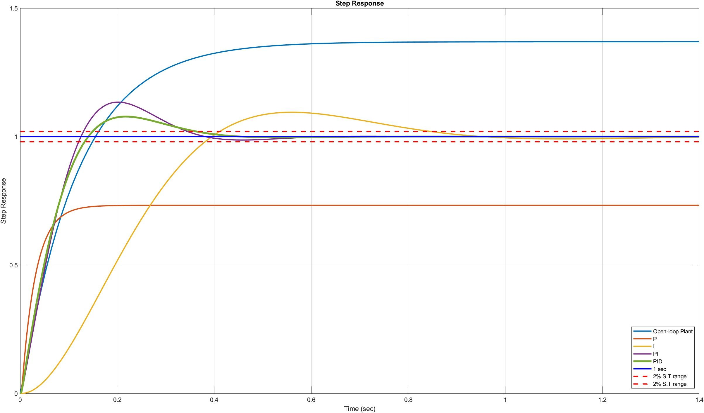

# System-ID-and-Speed-Control-of-DC-Servo-Motor
**To design a feedback compensator meeting performance specifications for DC Servo Motor model and thus evaluating stability margins** 

#### Objectives Achieved: 

- Constructed a Matlab LTI object using an analytic motor model and parameter values from manufacturers data sheets
- Estimated the open-loop frequency response from experimental time-domain data
- Validated the Matlab model by comparing the time domain and frequency domain responses 
- Designed a feedback compensator to meet time domain and frequency domain performance specifications
- Implement the compensator design as an LTI object
- Evaluate stability margins and performance metrics for your design 

#### Languages Used:
- Matlab
- Latex 

#### Use of each file:
- **SystemID_SpeedControl_DC_JapnitSethi.mlx** - Executable file with clearly defined problem statement and approach
- **SystemID_SpeedControl_DC_JapnitSethi.pdf** - Published Document for a quick check of Solutions and Code
- **exp_idtest.mat** - Consists of System ID Experimental Data collected for 60 sec @ 1000 Hz
- **eval_controller.p** - Matlab Program to do automatic analysis of our controller design

